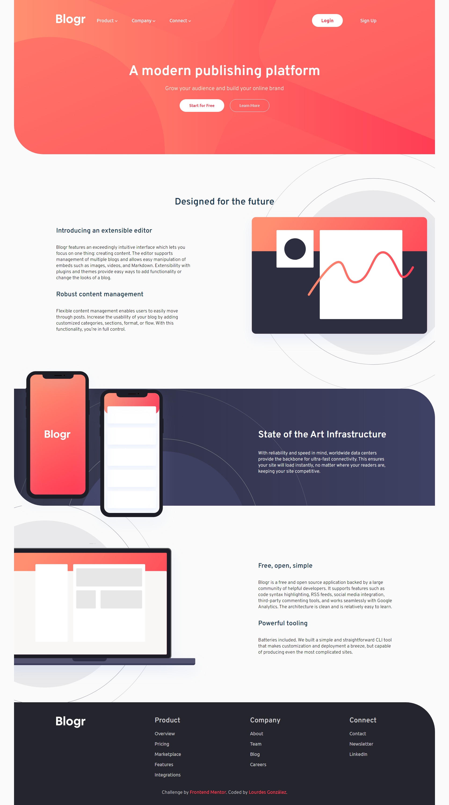

# Frontend Mentor - Blogr landing page

## Welcome! 👋

This is a solution to Blogr landing page on Frontend Mentor.

[Frontend Mentor](https://www.frontendmentor.io) challenges help you improve your coding skills by building realistic projects.

## The challenge

The challenge is to build out this landing page and get it looking as close to the design as possible.

The users should be able to:

- View the optimal layout for the site depending on their device's screen size
- See hover states for all interactive elements on the page

### Links

- Solution CODE: [https://github.com/lougc/blogr-landing-page/]
- Live Site URL: [https://lougc.github.io/blogr-landing-page/]

## My process

### Built with

- Semantic HTML5 markup
- CSS 
- Flexbox
- JavaScript Vanilla

## Author

- Website - [https://lougc.github.io/portfolio]
- Frontend Mentor - [https://www.frontendmentor.io/profile/lougc]
- Linkedin - [https://www.linkedin.com/in/lougc/]

